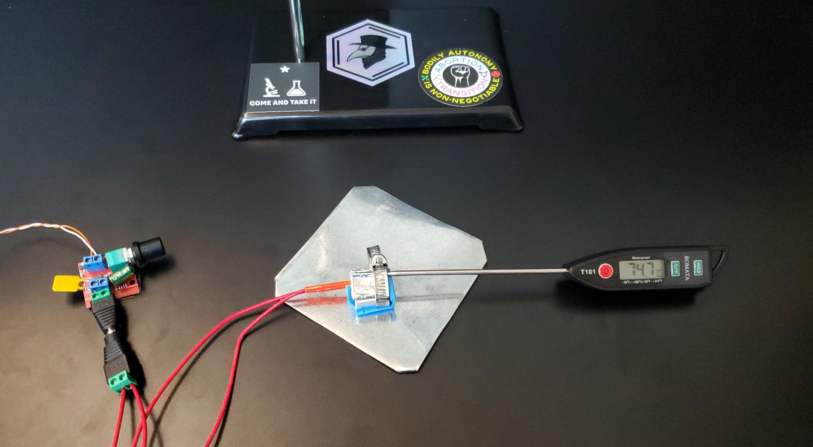

# Simple Melting Point Tester (or "SMelter")

The Simple Melting Point Tester ("SMelter" for short) is an open-source, DIY melting point tester that people can assemble with parts available online. It is intended to provide people with a rudimentary but robust way to test the purity of substances.

The SMelter is a dirt-cheap, dead-simple way to test the temperature at which a particular substance melts. [Testing the melting point](https://en.wikipedia.org/wiki/Melting-point_apparatus) of a chemical is a rudimentary technique to identify a subtance and determine its purity. The SMelter is intended to be used as a bare bones way to assess whether a powder you have is what you think it is.

Many chemical substances have their melting points listed online (check Wikipedia). Once you have that information, you can put a small amount of what you have on the SMelter, let it slowly heat up, and check whether your sample liquifies at the expected melting point. This does not confirm the content of the sample, but it is a strong indicator and erroneous results can indicate that a sample contains impurities or that is not what it is purported to be.

## The AnaLickTickle Suite

The AnaLickTickle suite is a collection of projects designed to provide accessible, DIY access to chemical analysis tools. The SMelter is the first and most basic tool in this suite.

## Getting Started Making and Using a SMelter

The core of the SMelter consists of a power supply, a control knob, a heating block, and a themometer. This lets you slowly heat up a block of metal while telling you how hot the block is. The docs include instructions for assembling the parts as well as using the device to test your sample.

- [How to build a SMelter](./docs/assembly.md)
- [How to use a SMelter](./docs/usage.md)

## Caution! Chemicals are a Whole Thing!

When using the SMelter, always take appropriate safety precautions. Use it in a well-ventillated area, wear eye protection, and consider a mask or respirator. If you're using this device, it means you are not totally sure what you're dealing with - remember that!