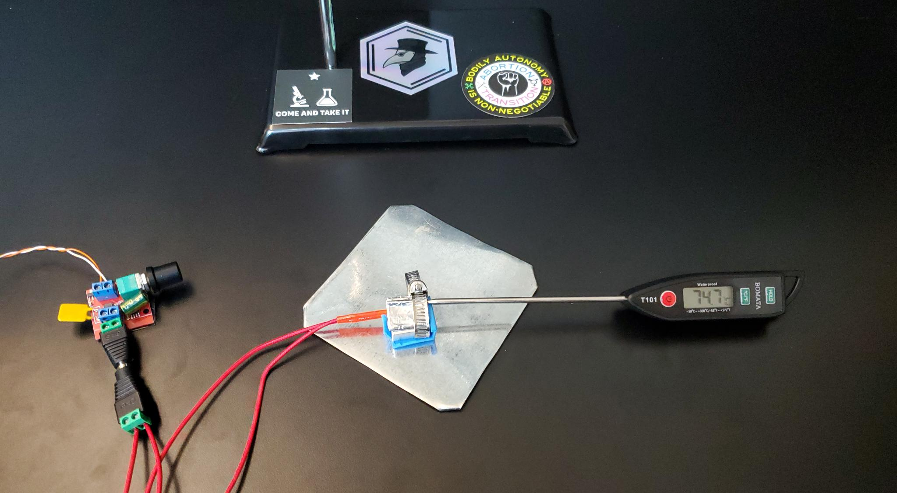

# SMelter Assembly

This doc will walk you through the tools, parts, and steps to assemble a SMelter.

## Tools Required

Assembling the SMelter requires a few tools:

- Small phillips head screwdriver to open and close the screw terminals
- Large flat head screwdriver for tightening the tube clamp
- Flush snips to trim excess leads from the PWM components (optional but recommended)
- (Maybe) a small hex tool (often 1.5mm) for the set screw on the heat block - check the heat blocks when you're buying and what screwdriver they require, or get a screwdriver kit with a big "variety pack" of bits (You'll thank us later)

## Parts

The SMelter consists of a small number of parts that can be purchased online for around $30. Often these are cheapest in multi-packs. The full list is:

- 12v 2A power supply (AKA a "wall wart" - you can also use 24v, but make sure the heater cartridge and PWM unit support that voltage!)
- Pulse Width Modulation (PWM) module that supports 12v or more
- 3d printer heat block and ceramic cartridge heater (make sure the heater matches your power supply)
- Tofu thermometer (or meat thermometer) - anything that goes up to 300C+ - the more accurate the better
- 5/8" - 1" hose clamp (or slightly larger)
- 15cm x 15cm square of aluminium foil
- Additional barrel plug connectors with screw terminals, 2 female, 1 male (optional, but recommended)
- 4 small lengths of solid core wire
- Silicone sleeve for the heat block
- Electrical tape

## Assembly

Assembling the SMelter has two major parts: (1) connecting the electrical components and (2) building the heat block assembly.

### Electrical Component Assembly

Assembling the electrical components of the SMelter involves connecting a few screw terminals using short lengths of wire. The goal is to connect the power supply to the heating element with the PWM module between them so that you can control the temperature of the heating block. When screwing down the screw terminals, be firm to ensure a tight connection but do not over-tighten as you may accidentally strip the screws.

- Begin by cutting 4 short sections of wire and stripping the ends so that roughly 3/8" of wire is exposed.
- Use these wire segments to connect the barrel plug connectors to the PWM module. Be sure to connect the female plug to the input terminals and the male plug to the output terminals. Also check that the polarity (+ or -) on the input plug matches the PWM module's input terminals.
  - Note: you can skip the barrel plug connectors and connect directly to the PWM module's terminals, but this requires cutting and stripping the wall wart's wires. It also makes the whole thing a little more unwieldy when everything is connected.
  - Note: to prevent short circuits, we also recommend using flush snips to trim any leads that stick out from the bottom of the PWM's circuit board so that you can apply a few pieces of electrical tape to the bottom of the board. This is to help prevent shorts and shocks. You only need to cover the exposed silver parts - try not to cover any other components on the board as this could possibly contribute to overheating.
- Connect the ceramic cartridge heater to the remaining female barrel plug connector. Polarity does not matter here.

Congratulations! You have wired the SMelter's electrical components! When it is time to operate the device, connect the male plug on the PWM module to the ceramic heater cartridge, and connect the male plug on the power supply to female plug connected to the PWM module.

The PWM module with plugs attached

The heater cartridge with plug attached

The power supply

### Heat Block Assembly

Assembling the heat block requires connecting the heat block, aluminum foil, heater cartridge, and thermometer so that they are firmly attached to one another. Use clean, smooth foil so that it can be compacted into as close to a solid block as possible.

#### Folding the Foil

- Begin by cutting some aluminium foil into a square roughly 15cm x 15cm. Fold it in half once in each direction to create a smaller square. Trim off any excess so that the edges are even.
- Fold this square along the same axis two additional times so that you have a long strip roughly 2cm x 8cm. Then, fold that strip in half two more times so that you are left with a 2cm x 2cm aluminium square.
  - A note on folding: Try to smooth and flatten the foil as you fold. Eliminating air pockets will help make the block more efficient. When performing the final folds, you will get cleaner edges if you fold the outside edges in to meet in the center (see images).

#### Securing the Pieces

Now we will securely attach the various heating components together using the hose clamp. Once that is done, we will insert the heater cartridge into the heat block and secure it with the set screw.

- Place the hose clamp around the heat block with the screw / worm gear on the far side. The heat block should be oriented so that the set screw for the heater cartridge is on the bottom.
  - Note: Getting the hose clamp to fight tightly around the block can be a little tricky because of the block's sharp corners and the band's roundness. We recommend figuring out roughly where the corners will fit and then bending the band at those corners using pliers.
- Tighten the hose clamp part way, leaving enough space to insert the foil and thermometer probe. You can trim excess band if you desire.
- Insert the thermometer probe into the square of foil. The thermometer should be close to the top surface of the foil, as this will give the most accurate readings.
- Insert the foil and thermometer under the hose clamp band. The thermometer probe should be positioned above where the heat cartridge will be inserted and there should be enough space to place a small powder sample above the cartridge as well. Keeping the sample close to the thermometer and keeping them both equally distant from the heating cartridge will improve accuracy.
- Holding everything togther, tighten the band on the hose clamp using a screw driver. Once completely tightened, the thermometer and foil should both be held firmly in place on top of the heat block. Remember that you can always loosen the clamp to replace the foil or adjust the thermometer probe.
- Loosen the set screw on the bottom of the block and insert the heater cartridge, then tighten the set screw to hold the cartridge in place.
- Place the silicone sleeve around the heat block assembly. You may need to cut away certain parts to make it fit. Don't worry if it is not snug.

🎉 Congratulations! 🎉 

You have assembled the SMelter!

[Now check out how to use it](./usage.md)